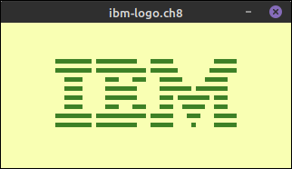
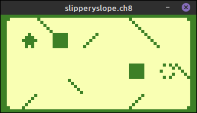

# chip8

*A Chip-8 emulator written in Golang*

---





## Build

Prerequisites:
* A copy of a recent version of the Go toolchain
* The [Mage build tool](https://magefile.org)
* The [dependencies for Ebiten](https://ebiten.org/documents/install.html)

```
git clone https://github.com/codemicro/chip8.git
cd chip8

mage build
# output in ./bin/yourOS-yourPlatform/chip8
```

## Run

```
Usage: chip8 [--verbose] [--scale SCALE] [--frequency FREQUENCY] [--clock CLOCK] [--foreground FOREGROUND] [--background BACKGROUND] INPUTFILE

Positional arguments:
  INPUTFILE

Options:
  --verbose, -v          enable verbose/debug mode
  --scale SCALE, -s SCALE
                         UI scale factor [default: 5]
  --frequency FREQUENCY
                         sound timer tone frequency [default: 350]
  --clock CLOCK, -c CLOCK
                         approximate clock speed in hertz [default: 500]
  --foreground FOREGROUND, -f FOREGROUND
                         foreground hex colour [default: 3D8026]
  --background BACKGROUND, -b BACKGROUND
                         background hex colour [default: F9FFB3]
  --help, -h             display this help and exit
```